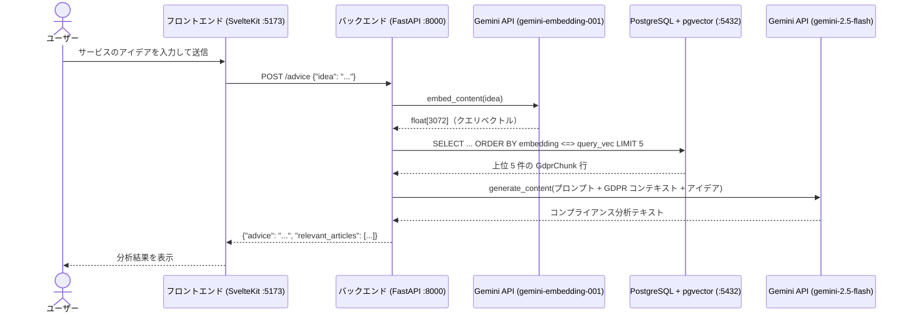
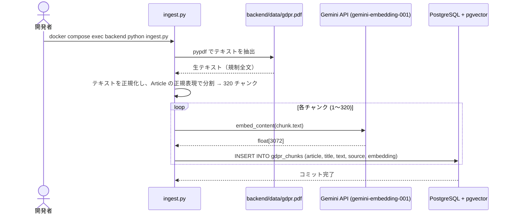
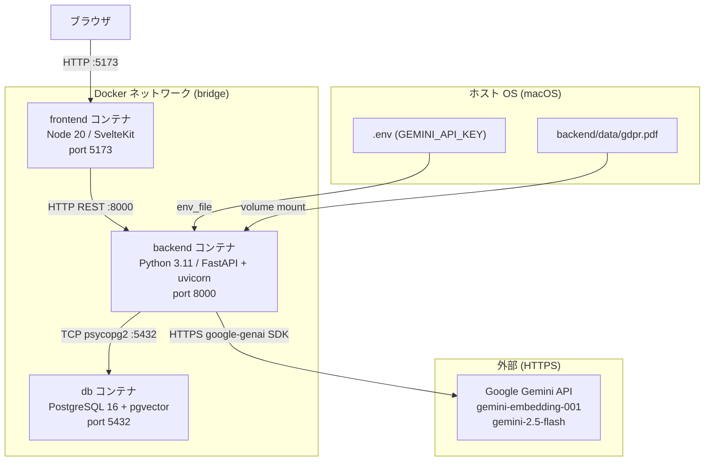

# GDPR アドバイザー

[English](README.md) | **日本語**

🔗 **ライブデモ:** https://gdpr-advisor.up.railway.app

GDPR（EU一般データ保護規則）の公式規制文書をナレッジベースとして、サービスのアイデアが GDPR に適合しているかを分析する RAG ベースの Web アプリケーションです。

---

## 仕組み

1. **取り込み（初回セットアップ時に一度だけ）:** GDPR の PDF を条文単位で 320 個のチャンクに分割し、Gemini API でベクトル化（埋め込み）して、pgvector 拡張を有効にした PostgreSQL に保存します。
2. **クエリ:** ユーザーがサービスのアイデアを入力すると、バックエンドがその内容をベクトル化し、コサイン類似度検索で最も関連性の高い GDPR 条文を 5 件取得します。それをコンテキストとして Gemini に渡し、コンプライアンス分析を生成します。

---

## システム構成

### リクエストの流れ



### 取り込みの流れ（初回のみ実行）



### コンポーネント概要



---

## 実行環境

```
┌──────────────────────────────────────────────────────────────────┐
│  ホスト OS (macOS)                                                │
│  ソースファイルはここに置かれる。.env に秘密情報を保持。          │
│  .venv/ は存在するが未使用 — 実行はすべて Docker 内で行う。       │
│                                                                    │
│  ┌────────────────────────────────────────────────────────────┐  │
│  │  Docker bridge ネットワーク (gdpr-app_default)              │  │
│  │                                                              │  │
│  │  ┌───────────────────────────────────────────────────────┐ │  │
│  │  │ backend コンテナ (python:3.11-slim)                    │ │  │
│  │  │  · pip でグローバルインストール（venv なし）           │ │  │
│  │  │  · /app を ./backend からマウント（uvicorn --reload    │ │  │
│  │  │    によるライブリロード）                               │ │  │
│  │  │  · GEMINI_API_KEY を .env から注入                     │ │  │
│  │  │  · DATABASE_URL は docker-compose.yml にハードコード   │ │  │
│  │  └───────────────────────────────────────────────────────┘ │  │
│  │                                                              │  │
│  │  ┌───────────────────────────────────────────────────────┐ │  │
│  │  │ frontend コンテナ (node:20-slim)                       │ │  │
│  │  │  · HMR を有効にした npm run dev                        │ │  │
│  │  │  · /app を ./frontend からマウント                     │ │  │
│  │  │  · node_modules は匿名ボリュームに分離                 │ │  │
│  │  └───────────────────────────────────────────────────────┘ │  │
│  │                                                              │  │
│  │  ┌───────────────────────────────────────────────────────┐ │  │
│  │  │ db コンテナ (pgvector/pgvector:pg16)                   │ │  │
│  │  │  · 名前付きボリューム postgres_data にデータを永続化    │ │  │
│  │  │  · pgvector 拡張により vector(3072) 型と                │ │  │
│  │  │    コサイン距離演算子 <=> が使用可能                    │ │  │
│  │  └───────────────────────────────────────────────────────┘ │  │
│  └────────────────────────────────────────────────────────────┘  │
└──────────────────────────────────────────────────────────────────┘
```

| レイヤー | 役割 |
|---|---|
| ホスト OS | ソースコード、`.env`、Docker の管理 |
| Docker bridge ネットワーク | サービス名 DNS（`db:5432`）によるコンテナ間通信 |
| backend コンテナ | FastAPI、Gemini SDK 呼び出し、SQL クエリ |
| frontend コンテナ | SvelteKit 開発サーバー、HMR |
| db コンテナ | PostgreSQL 16 + pgvector、ベクトル類似度検索 |

---

## ディレクトリ構成

```
gdpr-app/
├── .env                        # 秘密鍵 (GEMINI_API_KEY)。Git 管理対象外。
├── .gitignore
├── docker-compose.yml          # 3 つのサービス (backend / frontend / db)、
│                               # ポート、ボリューム、依存関係を定義。
│
├── backend/
│   ├── Dockerfile              # python:3.11-slim。システム依存
│   │                           # (build-essential, libpq-dev, poppler-utils,
│   │                           # tesseract-ocr) をインストールし uvicorn を起動。
│   ├── requirements.txt        # fastapi, uvicorn, sqlalchemy, psycopg2-binary,
│   │                           # pgvector, google-genai, pypdf, requests
│   ├── main.py                 # FastAPI アプリ。起動時に init_db() を呼ぶ。
│   │                           # POST /advice: クエリをベクトル化 → ベクトル検索
│   │                           # → LLM 生成 → JSON を返す。
│   ├── database.py             # gdpr_chunks テーブルの SQLAlchemy モデル。
│   │                           # init_db() が pgvector 拡張とテーブルを
│   │                           # （存在しなければ）作成する。
│   ├── ingest.py               # 初回のみ実行する前処理スクリプト。
│   │                           # PDF → テキスト → 320 条文チャンク →
│   │                           # Gemini 埋め込み → DB 挿入。
│   │                           # 429 レート制限のリトライ処理と、
│   │                           # API 呼び出し間の 0.7 秒スリープを含む。
│   ├── data/
│   │   └── gdpr.pdf            # GDPR ソース PDF（EUR-Lex から手動で
│   │                           # ダウンロード）。Git 管理対象外。
│   └── uploads/                # 以前の実装のレガシーディレクトリ。
│                               # 現在は未使用。
│
└── frontend/
    ├── Dockerfile              # node:20-slim。npm run dev を実行。
    ├── package.json            # SvelteKit 2 / Svelte 5 / Vite 7 / TypeScript
    ├── svelte.config.js        # adapter-auto（開発時は Vite 開発サーバー）
    ├── vite.config.ts          # Vite の設定
    └── src/
        ├── app.html            # SvelteKit プレースホルダー付き HTML シェル
        ├── app.d.ts            # TypeScript のグローバル型定義
        ├── lib/
        │   └── index.ts        # 共有ライブラリ（現在は空）
        └── routes/
            ├── +layout.svelte  # グローバルレイアウト（favicon のみ）
            └── +page.svelte    # メイン UI。テキストエリア入力 → POST /advice →
                                # アドバイステキストと条文バッジを描画。
```

---

## データベーススキーマ

テーブル: `gdpr_chunks`

| カラム | 型 | 説明 |
|---|---|---|
| `id` | `integer` | 主キー、自動採番 |
| `article` | `varchar(50)` | 例: `"Article 17"` |
| `title` | `varchar(255)` | 条文の見出しテキスト（最大 250 文字） |
| `text` | `text` | 条文の本文テキスト（最大 3000 文字） |
| `source` | `varchar(255)` | PDF ファイル名の語幹（例: `"gdpr"`） |
| `embedding` | `vector(3072)` | `gemini-embedding-001` の出力ベクトル |

ベクトル検索クエリ:
```sql
SELECT * FROM gdpr_chunks
ORDER BY embedding <=> :query_vector
LIMIT 5;
```

`<=>` 演算子はコサイン距離を計算します（値が小さいほど類似度が高い）。現在 IVFFlat インデックスは設定していません。大規模化する際にはインデックスを追加することでクエリ性能が向上します。

---

## 接続とプロトコル

| 接続 | プロトコル | ライブラリ | フォーマット |
|---|---|---|---|
| ブラウザ ↔ フロントエンド | HTTP (ポート 5173) | Vite 開発サーバー | HTML / JS |
| フロントエンド ↔ バックエンド | HTTP REST (ポート 8000) | fetch API | JSON |
| バックエンド ↔ Gemini 埋め込み | HTTPS | google-genai SDK | JSON (`float[3072]`) |
| バックエンド ↔ Gemini LLM | HTTPS | google-genai SDK (async) | JSON (テキスト) |
| バックエンド ↔ PostgreSQL | TCP (ポート 5432) | psycopg2 / SQLAlchemy | PostgreSQL ワイヤプロトコル |
| ベクトル検索 | SQL `<=>` 演算子 | pgvector | `vector(3072)` 上のコサイン距離 |

---

## セットアップ

### 前提条件

- Docker Desktop
- [Google Gemini API キー](https://aistudio.google.com/app/apikey)

### 1. 環境変数を設定

```bash
cp .env.example .env   # または手動で .env を作成
# 追記: GEMINI_API_KEY=your_key_here
```

### 2. コンテナを起動

```bash
docker compose up --build
```

### 3. GDPR PDF を配置

[EUR-Lex](https://eur-lex.europa.eu) から GDPR の PDF をダウンロードし（`32016R0679` で検索し、EN の PDF をダウンロード）、以下に配置します:

```
backend/data/gdpr.pdf
```

### 4. 取り込みを実行

```bash
docker compose exec backend python ingest.py
```

320 個の条文チャンクをすべて埋め込み、データベースに保存します。実行は一度だけで十分です。

### 5. アプリを開く

[http://localhost:5173](http://localhost:5173) にアクセスします。

---

## 技術スタック

| レイヤー | 技術 |
|---|---|
| フロントエンド | SvelteKit 2, Svelte 5, TypeScript, Vite 7 |
| バックエンド | Python 3.11, FastAPI, uvicorn |
| データベース | PostgreSQL 16, pgvector |
| ORM | SQLAlchemy, psycopg2 |
| AI / 埋め込み | Google Gemini API (`gemini-embedding-001`, `gemini-2.5-flash`) |
| PDF 解析 | pypdf |
| インフラ | Docker, Docker Compose |

---

*本ツールは GDPR の規制文書に基づく一般的な情報を提供するものであり、法的助言ではありません。*
