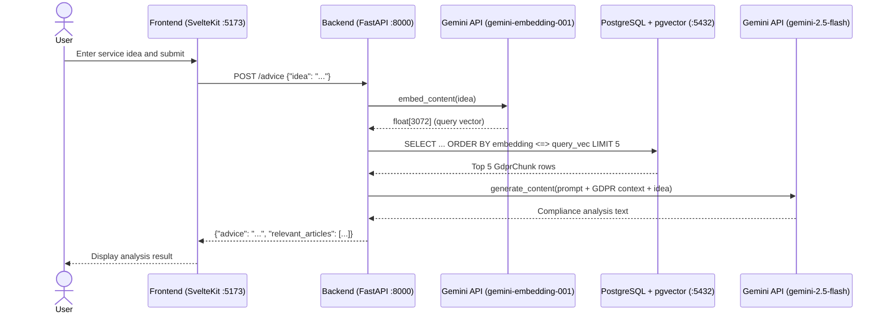
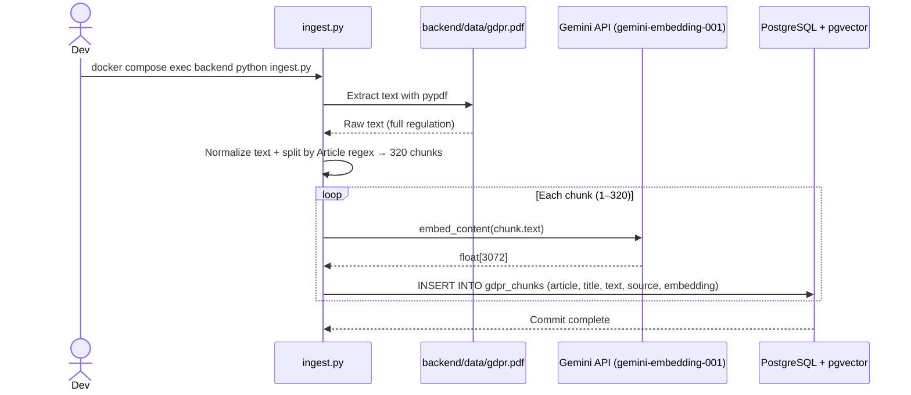
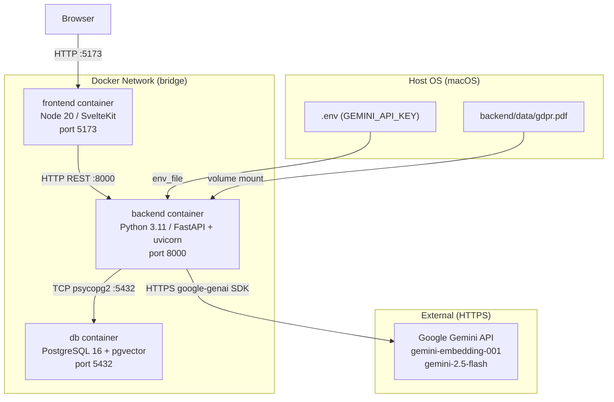

# GDPR Compliance Advisor

A RAG-based web application that analyzes service ideas for GDPR compliance using the official GDPR regulation text as its knowledge base.

---

## How It Works

1. **Ingest (one-time setup):** The GDPR PDF is split into 320 article-level chunks, embedded via the Gemini API, and stored in PostgreSQL with pgvector.
2. **Query:** The user describes a service idea. The backend embeds the query, retrieves the 5 most relevant GDPR articles via cosine similarity search, and passes them as context to Gemini for compliance analysis.

---

## System Architecture

### Request Flow



### Ingestion Flow (run once)



### Component Overview



---

## Execution Environment

```
┌──────────────────────────────────────────────────────────────────┐
│  Host OS (macOS)                                                  │
│  Source files live here. .env holds secrets.                      │
│  .venv/ exists but is unused — all execution is inside Docker.    │
│                                                                    │
│  ┌────────────────────────────────────────────────────────────┐  │
│  │  Docker bridge network (gdpr-app_default)                   │  │
│  │                                                              │  │
│  │  ┌───────────────────────────────────────────────────────┐ │  │
│  │  │ backend container (python:3.11-slim)                   │ │  │
│  │  │  · pip global install (no venv)                        │ │  │
│  │  │  · /app mounted from ./backend (live reload via        │ │  │
│  │  │    uvicorn --reload)                                    │ │  │
│  │  │  · GEMINI_API_KEY injected from .env                   │ │  │
│  │  │  · DATABASE_URL hardcoded in docker-compose.yml        │ │  │
│  │  └───────────────────────────────────────────────────────┘ │  │
│  │                                                              │  │
│  │  ┌───────────────────────────────────────────────────────┐ │  │
│  │  │ frontend container (node:20-slim)                      │ │  │
│  │  │  · npm run dev with HMR enabled                        │ │  │
│  │  │  · /app mounted from ./frontend                        │ │  │
│  │  │  · node_modules isolated in anonymous volume           │ │  │
│  │  └───────────────────────────────────────────────────────┘ │  │
│  │                                                              │  │
│  │  ┌───────────────────────────────────────────────────────┐ │  │
│  │  │ db container (pgvector/pgvector:pg16)                  │ │  │
│  │  │  · Data persisted in named volume: postgres_data       │ │  │
│  │  │  · pgvector extension enables vector(3072) type and    │ │  │
│  │  │    cosine distance operator <=>                         │ │  │
│  │  └───────────────────────────────────────────────────────┘ │  │
│  └────────────────────────────────────────────────────────────┘  │
└──────────────────────────────────────────────────────────────────┘
```

| Layer | Role |
|---|---|
| Host OS | Source code, `.env`, Docker management |
| Docker bridge network | Inter-container communication via service name DNS (`db:5432`) |
| backend container | FastAPI, Gemini SDK calls, SQL queries |
| frontend container | SvelteKit dev server, HMR |
| db container | PostgreSQL 16 + pgvector, vector similarity search |

---

## Directory Structure

```
gdpr-app/
├── .env                        # Secret keys (GEMINI_API_KEY). Git-ignored.
├── .gitignore
├── docker-compose.yml          # Defines 3 services (backend / frontend / db),
│                               # ports, volumes, and dependencies.
│
├── backend/
│   ├── Dockerfile              # python:3.11-slim. Installs system deps
│   │                           # (build-essential, libpq-dev, poppler-utils,
│   │                           # tesseract-ocr) then starts uvicorn.
│   ├── requirements.txt        # fastapi, uvicorn, sqlalchemy, psycopg2-binary,
│   │                           # pgvector, google-genai, pypdf, requests
│   ├── main.py                 # FastAPI app. On startup calls init_db().
│   │                           # POST /advice: embed query → vector search
│   │                           # → LLM generation → return JSON.
│   ├── database.py             # SQLAlchemy model for gdpr_chunks table.
│   │                           # init_db() creates the pgvector extension
│   │                           # and the table if they don't exist.
│   ├── ingest.py               # One-time preprocessing script.
│   │                           # PDF → text → 320 article chunks →
│   │                           # Gemini embeddings → DB insert.
│   │                           # Includes retry logic for 429 rate limit
│   │                           # and 0.7s sleep between API calls.
│   ├── data/
│   │   └── gdpr.pdf            # GDPR source PDF (downloaded manually
│   │                           # from EUR-Lex). Git-ignored.
│   └── uploads/                # Legacy directory from previous implementation.
│                               # No longer used.
│
└── frontend/
    ├── Dockerfile              # node:20-slim. Runs npm run dev.
    ├── package.json            # SvelteKit 2 / Svelte 5 / Vite 7 / TypeScript
    ├── svelte.config.js        # adapter-auto (Vite dev server in development)
    ├── vite.config.ts          # Vite configuration
    └── src/
        ├── app.html            # HTML shell with SvelteKit placeholders
        ├── app.d.ts            # TypeScript global type definitions
        ├── lib/
        │   └── index.ts        # Shared library (currently empty)
        └── routes/
            ├── +layout.svelte  # Global layout (favicon only)
            └── +page.svelte    # Main UI. Textarea input → POST /advice →
                                # renders advice text and article badges.
```

---

## Database Schema

Table: `gdpr_chunks`

| Column | Type | Description |
|---|---|---|
| `id` | `integer` | Primary key, auto-increment |
| `article` | `varchar(50)` | e.g. `"Article 17"` |
| `title` | `varchar(255)` | Article header text (up to 250 chars) |
| `text` | `text` | Article body text (up to 3000 chars) |
| `source` | `varchar(255)` | PDF filename stem (e.g. `"gdpr"`) |
| `embedding` | `vector(3072)` | Output vector from `gemini-embedding-001` |

Vector search query:
```sql
SELECT * FROM gdpr_chunks
ORDER BY embedding <=> :query_vector
LIMIT 5;
```

The `<=>` operator computes cosine distance (lower = more similar). No IVFFlat index is currently configured; adding one would improve query performance at larger scales.

---

## Connections & Protocols

| Connection | Protocol | Library | Format |
|---|---|---|---|
| Browser ↔ Frontend | HTTP (port 5173) | Vite dev server | HTML / JS |
| Frontend ↔ Backend | HTTP REST (port 8000) | fetch API | JSON |
| Backend ↔ Gemini Embedding | HTTPS | google-genai SDK | JSON (`float[3072]`) |
| Backend ↔ Gemini LLM | HTTPS | google-genai SDK (async) | JSON (text) |
| Backend ↔ PostgreSQL | TCP (port 5432) | psycopg2 / SQLAlchemy | PostgreSQL wire protocol |
| Vector search | SQL `<=>` operator | pgvector | Cosine distance on `vector(3072)` |

---

## Setup

### Prerequisites

- Docker Desktop
- A [Google Gemini API key](https://aistudio.google.com/app/apikey)

### 1. Configure environment

```bash
cp .env.example .env   # or create .env manually
# Add: GEMINI_API_KEY=your_key_here
```

### 2. Start containers

```bash
docker compose up --build
```

### 3. Add GDPR PDF

Download the GDPR PDF from [EUR-Lex](https://eur-lex.europa.eu) (search `32016R0679`, download the EN PDF) and place it at:

```
backend/data/gdpr.pdf
```

### 4. Run ingestion

```bash
docker compose exec backend python ingest.py
```

This embeds all 320 article chunks and stores them in the database. Only needs to be run once.

### 5. Open the app

Visit [http://localhost:5173](http://localhost:5173)

---

## Tech Stack

| Layer | Technology |
|---|---|
| Frontend | SvelteKit 2, Svelte 5, TypeScript, Vite 7 |
| Backend | Python 3.11, FastAPI, uvicorn |
| Database | PostgreSQL 16, pgvector |
| ORM | SQLAlchemy, psycopg2 |
| AI / Embeddings | Google Gemini API (`gemini-embedding-001`, `gemini-2.5-flash`) |
| PDF parsing | pypdf |
| Infrastructure | Docker, Docker Compose |

---

*This tool provides general information based on the GDPR regulation text. It is not legal advice.*
